# Securing a Web Application

Name: Trần Vỹ Anh
StudentID: 22024508

## Overview
This project demonstrates how to secure a web application using Spring Boot and Spring Security. It provides basic authentication and authorization features, utilizing a simple in-memory user store.

## Key Features
- User authentication and authorization
- Custom login page
- In-memory user store
- Thymeleaf templates for the user interface

## Installation Guide
1. Create a database name `securitydb`

2. Build the project using Maven:
    ```sh
    mvn clean install
    ```

3. Run the application:
    ```sh
    mvn spring-boot:run
    ```

## Usage Guide
- Access the application at `http://localhost:8080`
- Log in with the following credentials:
  - User:
      - Username: `user`
      - Password: `password`
  - Admin:
      - Username: `admin`
      - Password: `admin`

## Extend Version
### Store data in DataBase and BCryptPasswordEncoder
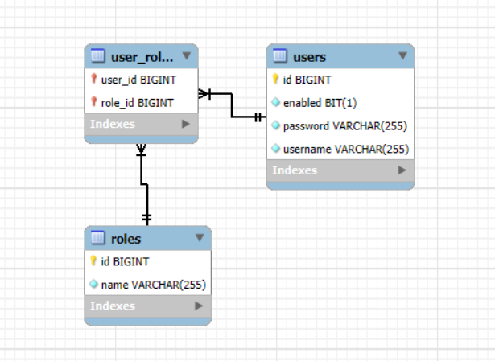
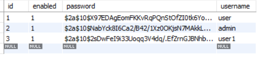
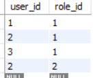
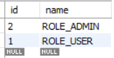

### User
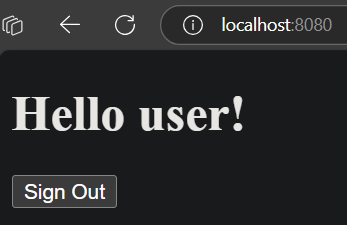
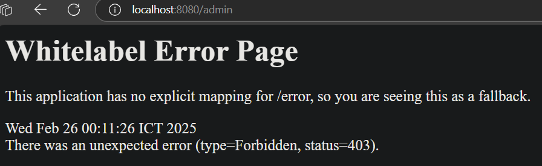
### Admin 
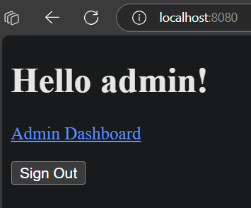
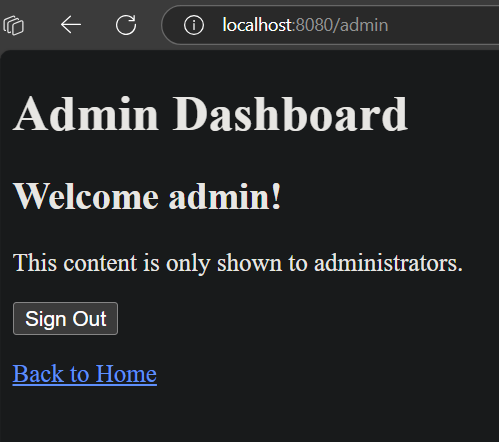
### Register new user
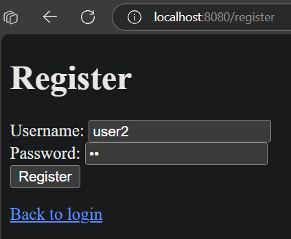
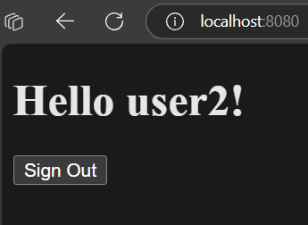
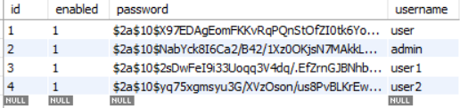
